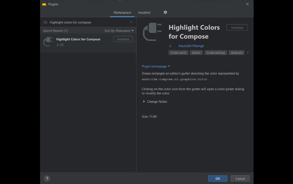

# Highlight Colors for Compose


[](https://plugins.jetbrains.com/plugin/15439-highlight-colors-for-compose)

A plugin for **Intellij** based IDEs to draw rectangle on the editor's gutter denoting the color represented by `androidx.compose.ui.graphics.Color`

Clicking on the color icon from the gutter will open a color picker dialog to modify the color.

Only those property satisfying the following pattern will be highlighted.

```kotlin
$modifier $name = Color($int)
```

```diff
- Color(0XFF000000) // Not supported
+ val black = Color(0XFF000000)
```

<>



<>

## Installation

- Using IDE built-in plugin system:

  <kbd>Preferences</kbd> > <kbd>Plugins</kbd> > <kbd>Marketplace</kbd> > <kbd>Search for "Highlight Colors for Compose"</kbd> >
  <kbd>Install Plugin</kbd>

- Manually:

  Download the [latest release](https://github.com/KaustubhPatange/compose-color/releases/latest) and install it manually using
  <kbd>Preferences</kbd> > <kbd>Plugins</kbd> > <kbd>⚙️</kbd> > <kbd>Install plugin from disk...</kbd>

## License

- [The Apache License Version 2.0](https://www.apache.org/licenses/LICENSE-2.0.txt)

```
Copyright 2020 Kaustubh Patange

Licensed under the Apache License, Version 2.0 (the "License");
you may not use this file except in compliance with the License.
You may obtain a copy of the License at

   https://www.apache.org/licenses/LICENSE-2.0

Unless required by applicable law or agreed to in writing, software
distributed under the License is distributed on an "AS IS" BASIS,
WITHOUT WARRANTIES OR CONDITIONS OF ANY KIND, either express or implied.
See the License for the specific language governing permissions and
limitations under the License.
```
